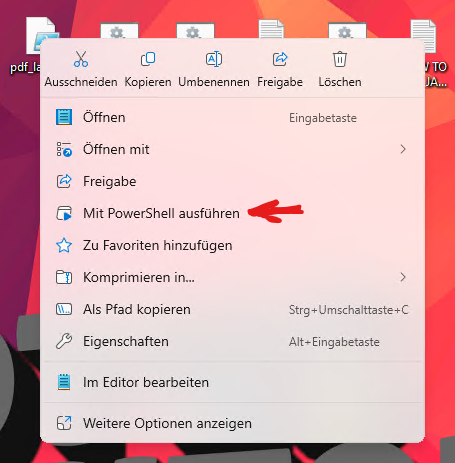

# PDF Layouting

Script for pdf pre-processing prior to chunking and embedding in LLM RAG use

## install

### clone the repo
```
git clone git@github.com:ifii-eu/pdf-layouting.git
```
### setup venv
```bash
python -m venv venv
# CMD Windows
.\venv\Scripts\activate.bat
# bash windows
source venv/Scripts/activate
# bash linux
source venv/bin/activate
```


### install dependencies
```
python -m venv venv
```

## Using the example

There's example data and output in the repository in the form of

```bash
# example pdf input
documents/strategie.pdf.example
# example layouting inference output
layout_data/boxes.json.example
# example annotated pdf output
output_pdf/output_1744614559_strategie.pdf.example
# example generated markdown output
output_md/output_1744614878.example
```

To test the example, create un-suffixed copies of the example data using
```bash
./util/use_example.sh
```
The run:

```bash
# Usage: python __main__.py input.pdf boxes.json
python __main__.py documents/strategie.pdf layout_data/boxes.json
```

## Processing your own documents
You need to request bounding box data for the pdf from the [HURIDOCS/pdf-document-layout-analysis](https://huggingface.co/HURIDOCS/pdf-document-layout-analysis) server

You can try this with the example after de-suffixing the example files using 

```bash
./util/request_layout.sh
```
or use the command

```bash
# Usage: curl -X POST -F 'file=@<path-to-your-file.pdf>' <layouting_server_IP>:layouting_server_port > <path-to-your-output.json>
curl -X POST -F 'file=@documents/strategie.pdf' 192.168.30.73:5060 > layout_data/boxes.json
```

## Starting HURIDOCS/pdf-document-layout-analysis server
On the GPU-Server, run the corresponding powershell-Script ```pdf_layouting.ps1``` on the desktop and wait for the container to start.


